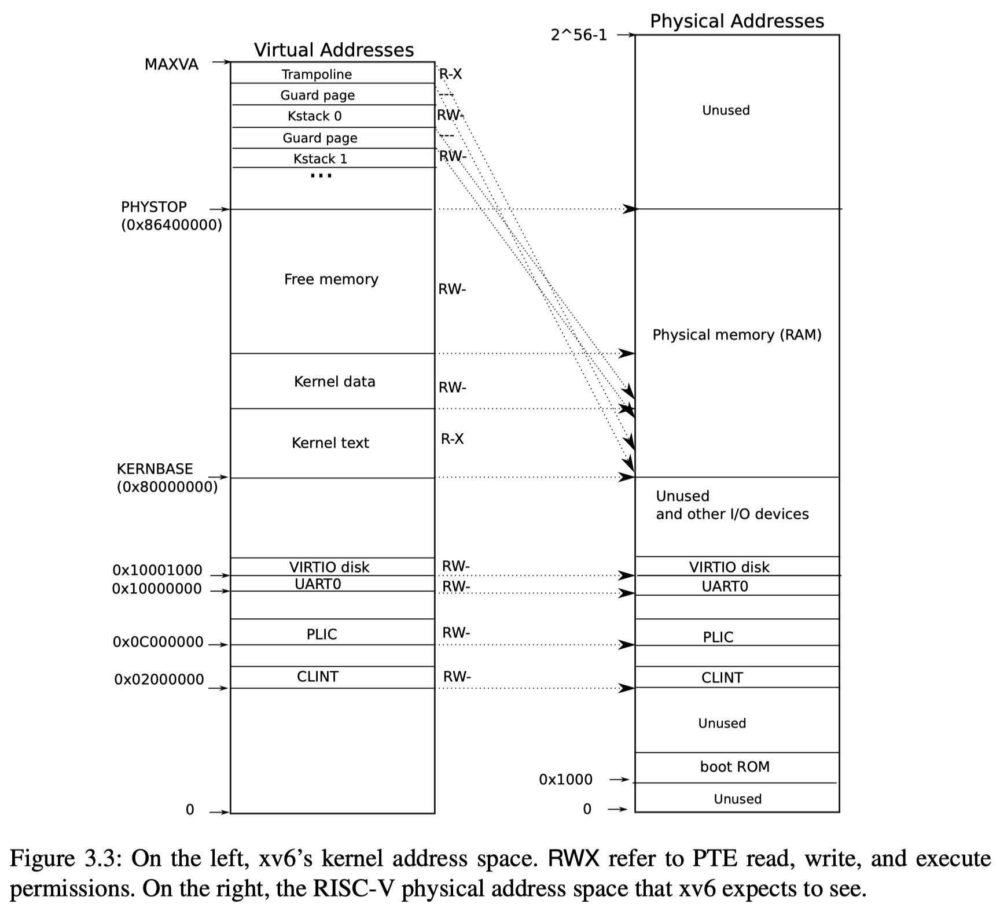
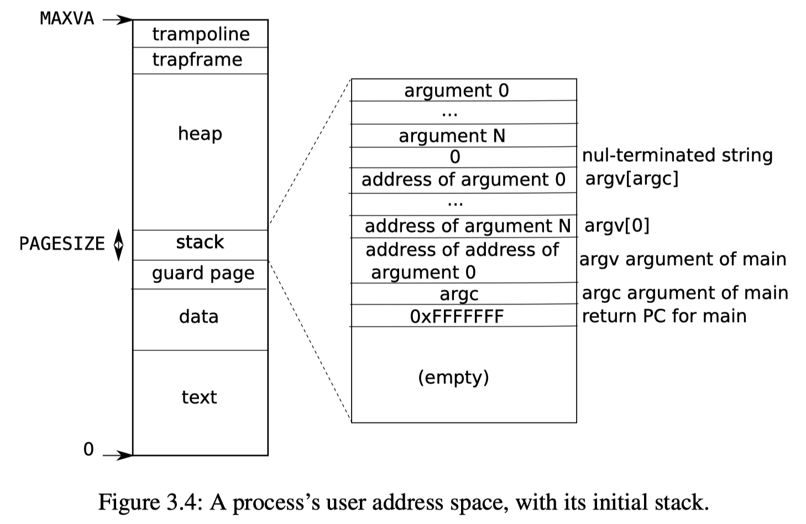

# KErnelOS: 内存管理模块

v0.1 2021/05/04 程乾宇 KErnelOS Group

### 简述

**内存管理**是操作系统所要解决的基本问题之一。在现代操作系统中，利用MMU (内存管理单元, Memory Management Unit) 硬件的**地址映射**功能，可以对连续地址空间进行离散空间分配。因此，为了避免物理内存空间的浪费，我们一般使用分页策略对物理内存进行分配。

根据RISC-V sv39分页机制标准，虚拟地址中保留低12位页偏移量。因此，我们按4KB大小划分物理内存为页框 (Frame)，进行内存对齐。为了实现高效的**离散空间（页框）分配**，我们需要专门实现**页分配的分配器**。

现代操作系统提供两种内存分配方式：**静态分配与动态分配**。

动态分配在**运行时**完成，在预先定义的**堆**上进行**连续空间分配**。由于分配方式不同，我们还需要专门实现**堆分配的分配器**。（实际上，这里的连续空间指的是虚拟地址空间，物理分配上还是离散的）

静态分配在**编译时**完成，包括分配在**栈**上的，来自于正在执行的函数/函数调用栈上栈帧的**局部变量**，以及分配在程序数据段的**全局变量**等。

考虑到内核代码的灵活性，我们在操作系统内部，对**地址空间分段**进行了软件实现。同时，我们使用上述实现的页分配分配器，在段的集合（地址空间数据结构）上完成从虚拟地址到物理地址的映射。

最终我们将内存管理模块划分为三个子模块：堆分配子模块，页分配子模块，地址空间子模块。模块整体实例化三个数据结构：页分配分配器，堆分配分配器，内核地址空间，以及一个初始化函数。

### 堆分配子模块

```rust
// 内部结构
pub struct HeapAllocator; // 此数据结构维护空闲堆空间列表
pub struct LockedHeapAllocator(Mutex<HeapAllocator>);

trait core::alloc::GlobalAlloc{
  unsafe fn alloc(&self, layout: core::alloc::Layout) -> *mut u8;
  unsafe fn dealloc(&self, ptr: *mut u8, layout: core::alloc::Layout);
}

impl core::alloc::GlobalAlloc for LockedHeapAllocator;
impl LockedHeapAllocator{
	pub fn new() -> Self;
}
impl HeapAllocator{
  pub fn new() -> Self;
  pub fn init(&self, heap_ptr: *mut u8, size: usize);
}
```

实例化全局对象LockedHeapAllocator，定义为#[global_allocator]。

创建一个全局数组，传递其指针给动态分配器。

```rust
// 子模块接口
pub fn init_heap_allocator(heap_ptr: *mut u8, size: usize);
```

### 页分配子模块

```rust
// 内部结构
// 地址抽象
// 支持页号-地址转换、数字-地址转换、数字-页号转换
#[derive(Copy, Clone, Ord, PartialOrd, Eq, PartialEq)]
pub struct PhysAddr(pub usize);
#[derive(Copy, Clone, Ord, PartialOrd, Eq, PartialEq)]
pub struct VirtAddr(pub usize);
#[derive(Copy, Clone, Ord, PartialOrd, Eq, PartialEq)]
pub struct PhysPageNum(pub usize);
#[derive(Copy, Clone, Ord, PartialOrd, Eq, PartialEq)]
pub struct VirtPageNum(pub usize);
impl PhysAddr { // 页4K对齐
	pub fn floor(&self) -> PhysPageNum { PhysPageNum(self.0 / PAGE_SIZE) }
	pub fn ceil(&self) -> PhysPageNum { PhysPageNum((self.0 + PAGE_SIZE - 1) / PAGE_SIZE) }
	pub fn page_offset(&self) -> usize { self.0 & (PAGE_SIZE - 1) }
}
impl PhysPageNum{	// 展开物理页内容
  pub fn get_pte_array(&self) -> &'static mut [PageTableEntry];
  pub fn get_bytes_array(&self) -> &'static mut [u8];
  pub fn get_mut<T>(&self) -> &'static mut T;
}
impl VirtPageNum{
  pub fn vpn_split(&self) -> [usize; 3]; // 三级页号
}

// 页表项抽象
bitflags! {
	pub struct PTEFlags: u8 {
		const V = 1 << 0;
		const R = 1 << 1;
		const W = 1 << 2;
		const X = 1 << 3;
		const U = 1 << 4;
		const G = 1 << 5;
		const A = 1 << 6;
		const D = 1 << 7;
	}
}
#[derive(Copy, Clone)]
#[repr(C)]
pub struct PageTableEntry {
	pub bits: usize,
}
impl PageTableEntry {
	pub fn new(ppn: PhysPageNum, flags: PTEFlags) -> Self;	// 构造页表项
	pub fn empty() -> Self; // 清零的页表项
	pub fn ppn(&self) -> PhysPageNum
	pub fn flags(&self) -> PTEFlags
  pub fn is_valid(&self) -> bool
}

// 页框分配器抽象
trait FrameAlloc {
	fn new() -> Self; // 初始分配器，无空闲页表
	fn init(&self, start_ppn: PhysPageNum, end_ppn: PhysPageNum);
	fn alloc(&mut self) -> Option<PhysPageNum>;
	fn dealloc(&mut self, ppn: PhysPageNum);
}
pub struct FrameAllocator;	// 此数据结构维护空闲页框列表
pub struct LockedFrameAllocator(Mutex<FrameAllocator>);
impl FrameAlloc for FrameAllocator;
impl LockedFrameAllocator{
	pub fn new() -> Self;
}
fn frame_dealloc(ppn: PhysPageNum);
pub trait Drop {
	pub fn drop(&mut self);
}
impl Drop for Page;

// 页抽象
pub struct Page{
	pub ppn: PhysPageNum,
}
impl Page{
  pub fn new(ppn: PhysPageNum) -> Self; // 页框内清零
}

// 页表抽象
pub struct PageTable(root_ppn: usize, pages: Vec<Page>); // 维护根页表，页列表
impl PageTable{
  pub fn new() -> Self; // 新分配页表
  pub fn from_token(satp: usize) -> Self // 根据satp寄存器设置确定页表所在物理页号
  
  fn find_pte_create(&mut self, vpn: VirtPageNum) -> Option<&mut PageTableEntry>;	// 查找页表项，自动创建
	pub fn map(&mut self, vpn: VirtPageNum, ppn: PhysPageNum, flags: PTEFlags); //创建页表映射
	pub fn unmap(&mut self, vpn: VirtPageNum); //删除页表映射
  fn find_pte_create(&self, vpn: VirtPageNum) -> Option<&mut PageTableEntry>; // 查找最后一层页表项，找不到自动创建
	fn find_pte_no_create(&self, vpn: VirtPageNum) -> Option<&PageTableEntry>; // 查找最后一层页表项，不创建
	pub fn translate(&self, vpn: VirtPageNum) -> Option<PageTableEntry> // 翻译返回对应最后一层页表项
  pub fn token(&self) -> usize; // 页表对应satp值
}
```

实例化全局对象LockedFrameAllocator。

查询内核空间终止地址，传递页分配可用物理页号范围。

提供分配和释放页框的接口。

```rust
// 子模块接口
pub fn init_frame_allocator(start_ppn: PhysPageNum, end_ppn: PhysPageNum);
pub fn frame_alloc() -> Option<Page>;

impl PageTable{
  pub fn new() -> Self; // 新分配页表
  pub fn from_token(satp: usize) -> Self // 根据satp寄存器设置确定页表所在物理页号
	pub fn map(&mut self, vpn: VirtPageNum, ppn: PhysPageNum, flags: PTEFlags); //创建页表映射
	pub fn unmap(&mut self, vpn: VirtPageNum); //删除页表映射
	pub fn translate(&self, vpn: VirtPageNum) -> Option<PageTableEntry> // 翻译返回对应最后一层页表项
  pub fn token(&self) -> usize; // 页表对应satp值
}
```

### 地址空间子模块

```rust
// 段抽象
pub enum SegType {
	Linear,	// 线性映射
	Framed,	// 页表映射
}
bitflags! {
	pub struct SegFlags: u8 {
		const R = 1 << 1;
		const W = 1 << 2;
		const X = 1 << 3;
		const U = 1 << 4;
	}
}
pub struct Segment {
	start_vpn: VirtPageNum;
  end_vpn: VirtPageNum;
	frames: BTreeMap<VirtPageNum, Page>,	//可能不需要维护
	type: SegType,
	flags: SegFlags,
}
impl Segment{
  pub fn new(start_va: VirtAddr, end_va: VirtAddr, type: SegType, flags: SegFlags) -> Self; // 新建指定地址范围段
  pub fn map_page(&mut self, page_table: &mut PageTable, vpn: VirtPageNum);
  pub fn map(&mut self, page_table: &mut PageTable);
  pub fn unmap_page(&mut self, page_table: &mut PageTable, vpn: VirtPageNum);
  pub fn unmap(&mut self, page_table: &mut PageTable);
  pub fn copy_data(&mut self, page_table: &mut PageTable, data: &[u8]); // 起始地址4K对齐

}

// 地址空间抽象
pub struct AddrSpace{
  page_table: PageTable;
  segments: Vec<Segment>;
}
impl AddrSpace{
  pub fn new() -> Self;	// 空地址空间, 新分配页表
  fn push(&mut self, mut segment: Segment, data: Option<&[u8]>);
  pub fn push_framed_seg(&mut self, start_va: VirtAddr, end_va: VirtAddr, flags: SegFlags); // 插入分页映射段
	fn map_trampoline(&mut self); // 映射Trap handler(Trampoline页)
  pub fn new_kernel() -> Self;	// 返回内核地址空间对象，此对象不分配内核栈段
  pub fn new_user_from_elf(elf_data: &[u8]) -> (Self, usize, usize) 	// 返回用户地址空间对象、用户栈顶地址、用户程序入口地址
  pub fn activate(&self); // 激活页表
  pub fn token(&self) -> usize; // 地址空间的页表对应satp值
}
pub struct LockedAddrSpace(Mutex<AddrSpace>);
impl LockedAddrSpace{
	pub fn new_kernel() -> Self;
}
```

实例化LockedAddrSpace为内核地址空间。

实例化AddrSpace为不同用户程序的用户地址空间，绑定到PCB (Process Control Block) 上。

地址空间参考结构 (需要设计好Trap handler模块):

> Figure from: xv6 book, Chap.3 Page Tables
>
> 
>
> 

```rust
// 子模块接口
impl AddrSpace{
  pub fn new() -> Self;	// 空地址空间, 新分配页表
  pub fn push_framed_seg(&mut self, start_va: VirtAddr, end_va: VirtAddr, flags: SegFlags); // 插入分页映射段
  pub fn new_user_from_elf(elf_data: &[u8]) -> (Self, usize, usize) 	// 返回用户地址空间对象、用户栈顶地址、用户程序入口地址
  pub fn activate(&self); // 激活页表
  pub fn token(&self) -> usize; // 地址空间的页表对应satp值
}
impl LockedAddrSpace{
	pub fn new_kernel() -> Self;
}
pub fn get_kernel_ref(token: usize, ptr: *const u8, len: usize) -> Vec<&'static mut [u8]>; // 将用户地址空间的指针，翻译为内核地址空间可用的引用列表
pub fn init_kernel_space(); // 激活内核地址空间
```

### 整体数据结构与接口

```rust
extern "C" {
    fn ekernel();
}
static mut HEAP_SPACE: [u8; KERNEL_HEAP_SIZE] = [0; KERNEL_HEAP_SIZE];
static HEAP_ALLOCATOR: LockedHeap = LockedHeap::new();
lazy_static! {
	pub static ref FRAME_ALLOCATOR: LockedFrameAllocator = LockedFrameAllocator::new();
}
lazy_static! {
  pub static ref KERNEL_SPACE: Arc<LockedAddrSpace> = Arc::new(
		LockedAddrSpace::new_kernel()
  );
}
pub fn init() {
	heap_allocator::init_heap_allocator(HEAP_SPACE.as_ptr(), KERNEL_HEAP_SIZE);
	frame_allocator::init_frame_allocator(
		PhysAddr::from(ekernel as usize).ceil(), 
		PhysAddr::from(MEMORY_END).floor()
	);
	addr_space::init_kernel_space();
}

```

